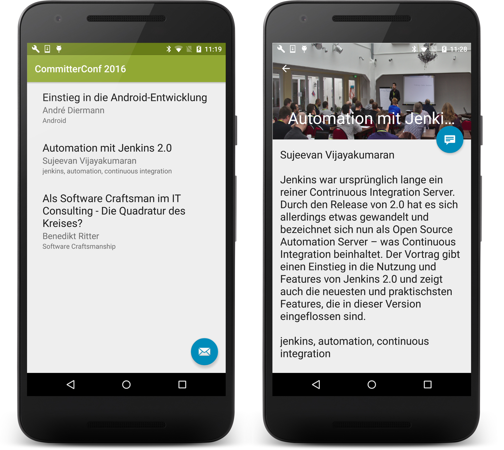

# CommitterConf 2016 Android Workshop
Code of the Android workshop at CommitterConf 2016.


# Slides
https://speakerdeck.com/a11n/introduction-into-android-development

# Prerequisites
```shell
npm install -g json-server

json-server --watch api.json
```

# Usage

```shell
git clone https://github.com/a11n/committerconf-2016-android.git

./gradlew installDebug
```

####Change server address:
In your `build.gradle` change the server address to the actual IP address of the machine you run `json-server`

```groovy
buildConfigField 'String', 'SERVER', '"http://<YOUR SERVER>:3000"'
```


